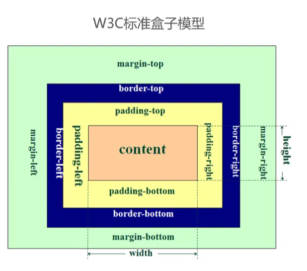
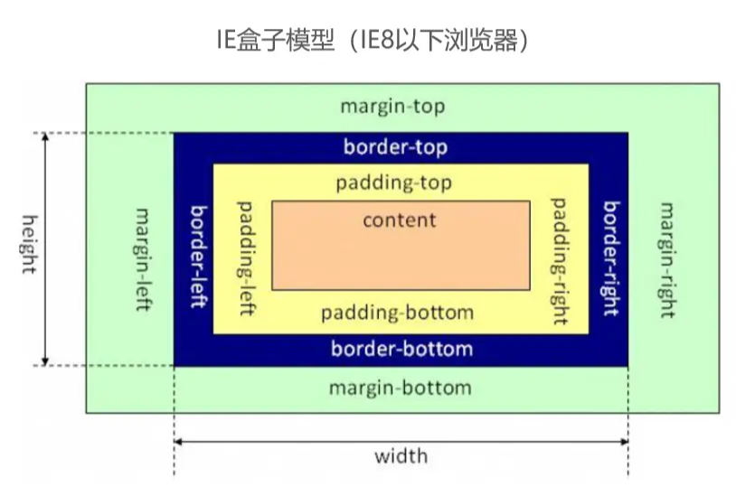

# 前端面试之道

## HTML面试题

### HTML语义化标签

1. 让人更容易读懂(增加代码的可读性)

2. 让搜索引擎更容易读懂(SEO)


### HTML标签块级元素和内联元素

::: tip 提示
块级元素：会独占一行。内联元素：不会独占一行，会挨着排列
:::

**块级元素**：`div`、`h1`、`h2`、`h3`、`h4`、`h5`、`h6`、`p`、`ul`、`ol`、`table`、`dl`、`dt`、`address`、`form`等

**内联元素**：`span`、`img`、`input`、`button`、`a`、`i`、`strong`、`code`、`sub`、`sup`、`em`等

## CSS面试题

### 盒模型的宽度计算
::: warning 区别
标准盒模型和IE盒模型
:::

**标准盒模型**：属性`width`和`height`只包含`content`，不包括`border`和`padding`。

`width` = `content`

`height` = `content`



**IE盒模型**：属性`width`和`height`除了包含`content`外，也包含`border`和`padding`。

:::warning 注意
IE盒模型宽度和高度要想和标准盒模型一样，可以通过`box-sizing: border-box`代码来实现
:::

`width` = `content` + `padding`(左右) + `border`(左右)（就是说width已经包含了padding和border值）

`height` = `content` + `padding`(上下) + `border`(上下)（就是说width已经包含了padding和border值）




### margin纵向重叠的问题

:::tip 解答
* 相邻元素的`margin-tip`和`margin-bottom`会发生重叠
* 中间空白内容的`<p></p>`也会重叠
* 所以下面代码的结果就是`30px`
:::

**代码演示**
```html
<!DOCTYPE html>
<html lang="en">
<head>
  <meta charset="UTF-8">
  <meta http-equiv="X-UA-Compatible" content="IE=edge">
  <meta name="viewport" content="width=device-width, initial-scale=1.0">
  <title>Document</title>
</head>
<style>
  p {
    margin-top: 20px;
    margin-bottom: 30px;
    background-color: red;
  }
</style>
<body>
  <p>11111111111</p>
  <p></p>
  <p></p>
  <p>2222222</p>
</body>
</html>
```

### margin负值的问题
:::tip 解答
* `margin-top`和`margin-left`负值，自身元素向上、向左移动
* `margin-right`负值，右侧元素左移，自身元素不受影响
* `margin-bottom`负值，下方元素上移，自身不受影响
* 下面代码想看哪个效果放开哪个注释的代码即可
:::

**代码演示**
```html
<!DOCTYPE html>
<html lang="en">
<head>
  <meta charset="UTF-8">
  <meta http-equiv="X-UA-Compatible" content="IE=edge">
  <meta name="viewport" content="width=device-width, initial-scale=1.0">
  <title>Document</title>
</head>
<style>
  body {
    margin: 30px;
  }

  .list {
    width: 500px;
    margin-bottom: 30px;
    border: 1px solid blue;
    padding: 10px 10px;
  }

  .clearfix {
    content: "";
    clear: both;
    display: table;
  }

  .box, .box1 {
    width: 100px;
    height: 100px;
    border: 1px solid #000;
  }

  .box1 {
    float: left;
  }

  /* 当margin-top为负值时，自身元素向上 */

  /* .item1 {
    margin-top: -20px;
  } */

  /* 当margin-bottom为负值时，下方元素上移，自身不受影响 */

  /* .item1 {
    margin-bottom: -20px;
  } */

  /* 当margin-left为负值时，自身向左移动 */

  /* .item3 {
    margin-left: -20px;
  } */

  /* 当margin-right为负值时，右侧元素左移，自身元素不受影响 */

  /* .item3 {
    margin-right: -20px;
  } */
  
</style>
<body>
  <p>测试margin top和bottom 的负值情况</p>
  <div class="list">
    <div class="box item1">1</div>
    <div class="box item2">2</div>
  </div>

  <p>测试margin left和right 的负值情况</p>
  <div class="list clearfix">
    <div class="box1 item3">3</div>
    <div class="box1 item4">4</div>
  </div>
</body>
</html>
```

### BFC理解和应用

### float布局和clearfix

### 圣杯布局和双飞翼布局


### 手写clearfix

### flex画色子

### absolute和relative依据什么定位


### 居中对齐有哪些实现方法

### line-height的继承问题


### rem是什么


### 如何实现响应式


### 