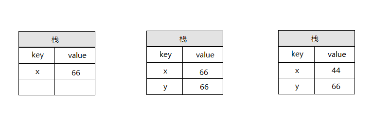
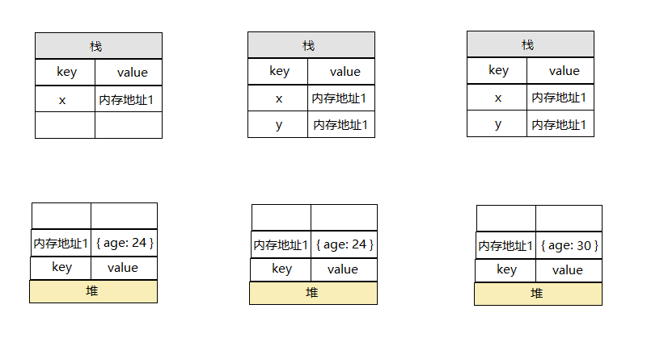

# 前端面试集合

## HTML面试题

### HTML语义化标签

1. 让人更容易读懂(增加代码的可读性)

2. 让搜索引擎更容易读懂(SEO)


### HTML标签块级元素和内联元素

::: tip 提示
块级元素：会独占一行。内联元素：不会独占一行，会挨着排列
:::

**块级元素**：`div`、`h1`、`h2`、`h3`、`h4`、`h5`、`h6`、`p`、`ul`、`ol`、`table`、`dl`、`dt`、`address`、`form`等

**内联元素**：`span`、`img`、`input`、`button`、`a`、`i`、`strong`、`code`、`sub`、`sup`、`em`等

## CSS面试题

### 盒模型的宽度计算
::: warning 区别
标准盒模型和IE盒模型
:::

**标准盒模型**：属性`width`和`height`只包含`content`，不包括`border`和`padding`。

`width` = `content`

`height` = `content`


**IE盒模型**：属性`width`和`height`除了包含`content`外，也包含`border`和`padding`。

:::warning 注意
IE盒模型宽度和高度要想和标准盒模型一样，可以通过`box-sizing: border-box`代码来实现
:::

`width` = `content` + `padding`(左右) + `border`(左右)（就是说width已经包含了padding和border值）

`height` = `content` + `padding`(上下) + `border`(上下)（就是说width已经包含了padding和border值）


### margin纵向重叠的问题

:::tip 解答
* 相邻元素的`margin-tip`和`margin-bottom`会发生重叠
* 中间空白内容的`<p></p>`也会重叠
* 所以下面代码的结果就是`30px`
:::

**代码演示**
```html
<!DOCTYPE html>
<html lang="en">
<head>
  <meta charset="UTF-8">
  <meta http-equiv="X-UA-Compatible" content="IE=edge">
  <meta name="viewport" content="width=device-width, initial-scale=1.0">
  <title>Document</title>
</head>
<style>
  p {
    margin-top: 20px;
    margin-bottom: 30px;
    background-color: red;
  }
</style>
<body>
  <p>11111111111</p>
  <p></p>
  <p></p>
  <p>2222222</p>
</body>
</html>
```

### margin负值的问题
:::tip 解答
* `margin-top`和`margin-left`负值，自身元素向上、向左移动
* `margin-right`负值，右侧元素左移，自身元素不受影响
* `margin-bottom`负值，下方元素上移，自身不受影响
* 下面代码想看哪个效果放开哪个注释的代码即可
:::

**代码演示**
```html
<!DOCTYPE html>
<html lang="en">
<head>
  <meta charset="UTF-8">
  <meta http-equiv="X-UA-Compatible" content="IE=edge">
  <meta name="viewport" content="width=device-width, initial-scale=1.0">
  <title>Document</title>
</head>
<style>
  body {
    margin: 30px;
  }

  .list {
    width: 500px;
    margin-bottom: 30px;
    border: 1px solid blue;
    padding: 10px 10px;
  }

  .clearfix {
    content: "";
    clear: both;
    display: table;
  }

  .box, .box1 {
    width: 100px;
    height: 100px;
    border: 1px solid #000;
  }

  .box1 {
    float: left;
  }

  /* 当margin-top为负值时，自身元素向上 */

  /* .item1 {
    margin-top: -20px;
  } */

  /* 当margin-bottom为负值时，下方元素上移，自身不受影响 */

  /* .item1 {
    margin-bottom: -20px;
  } */

  /* 当margin-left为负值时，自身向左移动 */

  /* .item3 {
    margin-left: -20px;
  } */

  /* 当margin-right为负值时，右侧元素左移，自身元素不受影响 */

  /* .item3 {
    margin-right: -20px;
  } */
  
</style>
<body>
  <p>测试margin top和bottom 的负值情况</p>
  <div class="list">
    <div class="box item1">1</div>
    <div class="box item2">2</div>
  </div>

  <p>测试margin left和right 的负值情况</p>
  <div class="list clearfix">
    <div class="box1 item3">3</div>
    <div class="box1 item4">4</div>
  </div>
</body>
</html>
```

### BFC理解和应用
:::tip 解释
* `Block format context` 块级格式化上下文
* 一块独立渲染区域，内部元素的渲染不会影响边界以外的元素
:::

**形成BFC的条件**
1. `float`不是`none`
2. `position`是`absolute`或`fixed`
3. `overflow`不是`visible`
4. `display`是`flex`或`inline-block`等
5. `html`根元素

**BFC主要的作用**
1. 清除浮动
2. 防止同一`BFC`容器中的相邻元素间的外边距重叠问题


**BFC 特性**
1. 内部`box`会在垂直方向，一个接一个地放置

2. `box`垂直方向的距离由`margin`决定，在一个`BFC`中，两个相邻的块级盒子的垂直外边距会产生折叠。(完整的说法是：属于同一个`BFC`的两个相邻`box`的`margin`会发生重叠(塌陷)，与方向无关)

3. 在`BFC`中，每一个盒子的左外边缘(`margin-left`)会触碰到容器的左边缘(`border-left`)(对于从右到左的格式来说，则触碰到右边缘)，即使浮动元素也是如此。(这说明`BFC`中子元素不会超出他的包含块，而`position`为`absolute`的元素可以超出他的包含块边界)

4. 形成了`BFC`的区域不会与`float box`重叠

5. 计算`BFC`高度时，浮动元素也参与计算

6. `BFC`就是页面上的一个隔离的独立容器，容器里面的子元素不会影响到外面元素，反之亦然

**代码演示**
```html
<!DOCTYPE html>
<html lang="en">
<head>
  <meta charset="UTF-8">
  <meta http-equiv="X-UA-Compatible" content="IE=edge">
  <meta name="viewport" content="width=device-width, initial-scale=1.0">
  <title>Document</title>
</head>
<style>
  img {
      float:left
  }
  /* 我们可以通过注释overflow:hidden查看不同效果 */
  .bfc {
      overflow:hidden;  /* 触发元素BFC */
  }
</style>
<body>
  <div class="box bfc">
    
    <p class="bfc">我是超长的文字<p>
  </div>
</body>
</html>
```

### float布局和clearfix

### 圣杯布局和双飞翼布局
:::tip 目的
* 三栏布局，中间一栏最先加载和渲染(内容最重要)
* 两侧内容固定，中间内容随着宽度自适应
* 一般用于`PC`网页
:::

**技术总结**
* 使用`float`布局
* 两侧使用`margin`负值，以便和中间内容横向重叠
* 防止中间内容被两侧覆盖，一个用`padding`一个用`margin`


## JavaScript基础知识题

### 值类型和引用类型

**值类型**
:::tip 提示
值类型是存储在栈中的，栈是从上往下的
:::

常见的值类型有`number`、`string`、`Boolean`、`undefined`、`symbol`
**代码分析**
```js
// 值类型
let x = 66;
let y = x;
x = 44;
console.log(y); // 66
```

值类型的占用空间少，复制对性能造成的影响很小




**引用类型**
:::tip 提示
引用类型是存储在堆中的，堆是从下往上的
:::

常见的引用类型有`Object`、`array`、`function`、`null`，其中`null`是特殊引用类型，指针指向为空地址。`function`函数不用于存储数据，一般不说复制函数和拷贝函数
引用类型有可能会很多，在复制过程中导致很慢，所以放在内存地址中

**代码分析**
```js
// 引用类型
let x = { age: 24 };
let y = x;
y.age = 30;
console.log(x.age); // 30
```

